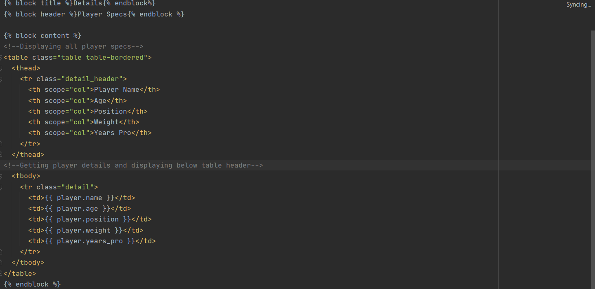
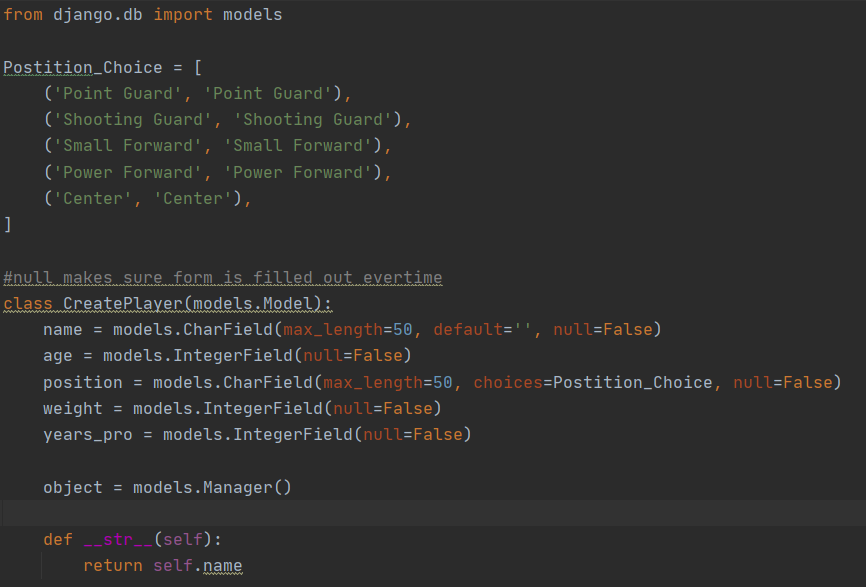

# Python-Live-Project
 
<h1>Django Project Information</h1>

During the past two weeks I have been developing a hobby manager web application with my fellow peers in the Tech Academy. This application required a combination of computer languages in order to produce the full product. These languages include HTML, CSS, Python, and Django. Throughout this project I have learned the important factors that go into creating a website based off of multiple templates and the inheritance between them. In order to get each part of the application to work together, a combination of both Python and Django were used on the back end so that each file was linked properly. These links include button functions, url mapping, and the ability to communicate with a database. The usage of the database was important for saving useful data related to the given hobby application.

With multiple languages working together, bugs and errors were bound to occur. Thankfully, I was able to overcome those unforseen obstacles and turn them into learning opportunities which in hand is very valuable. I am proud of what I have created, and I am fortunate for the opportunity to work with other peers and collaborate all I have been learning.

<h1>HTML Table Template</h1>

One of the biggest factors for this project was the usage of webpage templates and connecting each page together through inhertiance. This was able to be completed by first creating a base parent template that each page created after would have to follow. My application was focused on creating a list of basketball players and details about that player. My base template revolved around creating a player, and viewing players created by the user. Here is an example of what the code looks like behind viewing past games.

<h1>Database Model</h1>

Another important factor of this project was that usage of a database. Setting up user inputs was a must as there needed to be some way to communicate to the database with the user. This was mainly done through the use of Django and built in models to create a database. This page is one of the bigger pages in terms of functionality because it is what recorded the inputs and sent them to a given table. Based off of the primary keys in this table, a more in depth details page was able to be created. By calling the primary key, a link was able to be created that would identify any specific row in the table. This is an example of what the model looked like for recording user input.

